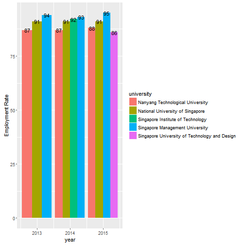
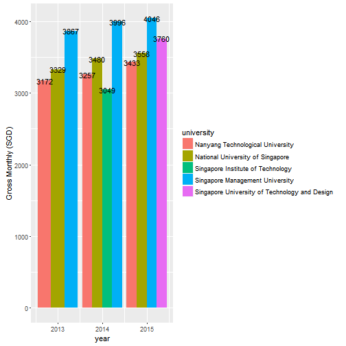
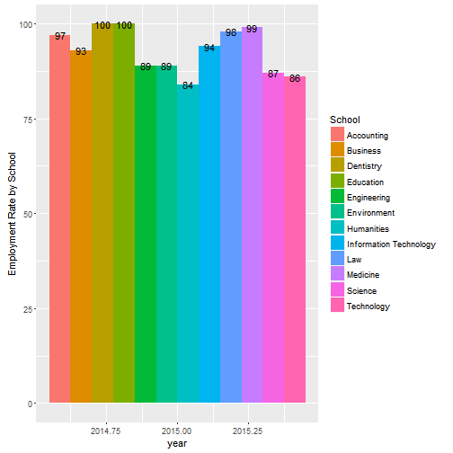

Singapore University Graduate Employment Survey
========================================================
author: Jia Lin
date: 26-June-2016
autosize: true
<small>
<font size="3">
- The orginal data is downloaded from [data.gov.sg](https://data.gov.sg/dataset/graduate-employment-survey-ntu-nus-sit-smu-sutd).  
- Any analysis or transformation of data are made by myself and shall not be attributed to the Singapore Government or its Statutory Boards;
- [terms to use](https://data.gov.sg/terms). 
</font>
</small>
Summary
========================================================
<small>
The datasets include three years, 5 universities' data. Type of school is added manually by myself.  
The app source is available at [GitHub](https://github.com/Jia-Lin/developing_data_products_assignment)
</small>
<font size="3">


```r
df <- read.csv("graduate-employment-survey-ntu-nus-sit-smu-sutd.csv", head=TRUE, na.strings = "na")
head(df)
```

```
  year                       university
1 2013 Nanyang Technological University
2 2013 Nanyang Technological University
3 2013 Nanyang Technological University
4 2013 Nanyang Technological University
5 2013 Nanyang Technological University
6 2013 Nanyang Technological University
                                        College      School
1 College of Business (Nanyang Business School)    Business
2 College of Business (Nanyang Business School)    Business
3 College of Business (Nanyang Business School)    Business
4 College of Business (Nanyang Business School)    Business
5                        College of Engineering Engineering
6                        College of Engineering Engineering
                                       degree employment_rate_overall
1                    Accountancy and Business                    97.4
2 Accountancy (3-yr direct Honours Programme)                    97.1
3    Business (3-yr direct Honours Programme)                    90.9
4                      Business and Computing                    87.5
5                       Aerospace Engineering                    95.3
6                              Bioengineering                    81.3
  employment_rate_permanent basic_monthly_mean basic_monthly_median
1                      96.1               3701                 3200
2                      95.7               2850                 2700
3                      85.7               3053                 3000
4                      87.5               3557                 3400
5                      95.3               3494                 3500
6                      68.8               2952                 2900
  gross_monthly_mean gross_monthly_median gross_mthly_25_percentile
1               3727                 3350                      2900
2               2938                 2700                      2700
3               3214                 3000                      2700
4               3615                 3400                      3000
5               3536                 3500                      3100
6               3166                 3125                      2893
  gross_mthly_75_percentile
1                      4000
2                      2900
3                      3500
4                      4100
5                      3816
6                      3365
```
</font>
Overall Employment Rate
========================================================
left: 40%
<font size ="5">
This graph shows the overall employment rate for all schools.
</font>
***


Gross Monthly Salary
========================================================
left: 40%
<font size ="5">
This graph shows the gross monthly salary mean for all schools.
</font>
***

Employment Rate by School
========================================================
left: 30%
<font size ="5">
This graph shows the employment rate by type of school in year 2015.
</font>
***

